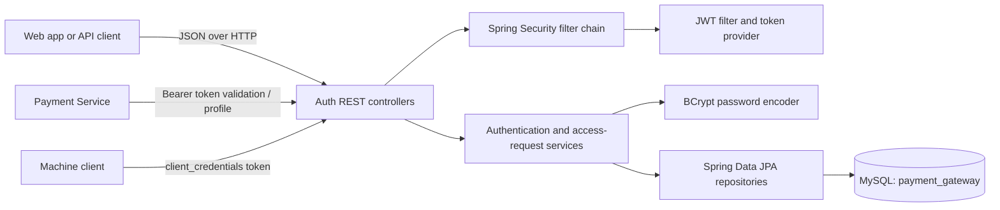

# Auth Service Architecture and Postman Guide

This guide describes the Auth Service as currently implemented and provides copyable requests for its user, administrator-access, and machine-client APIs.

## Service overview

The Auth Service runs on port `8082` and stores users, roles, refresh tokens, client applications, and administrator-access requests in the MySQL `payment_gateway` database. In the current local configuration, Hibernate uses `ddl-auto: update`, so it creates or updates mapped tables at startup. No separate SQL script is needed for local startup.



### Authentication and authorization

- User passwords and machine-client secrets are stored as BCrypt hashes.
- Public account registration always assigns `ROLE_USER`. The supplied `roles` property is not used to grant permissions.
- A user may request `ROLE_ADMIN` during registration or later. The request remains `PENDING` until an administrator approves it.
- A successful administrator approval adds `ROLE_ADMIN`. Sign in again after approval to receive a JWT containing the updated authorities.
- User access tokens last 15 minutes by default. User refresh tokens last 7 days and are rotated when refreshed. Changing a password deletes that user's refresh token.
- The Auth Service is stateless. Send user access tokens as `Authorization: Bearer <accessToken>` when calling protected user or admin endpoints.

**Initial administrator:** This service does not seed a default administrator account. An administrator must already be provisioned for the admin review endpoints to be usable. Do not rely on an undocumented default account.

### Current endpoint access

The current security configuration permits `/api/v1/auth/**` anonymously except for `POST /api/v1/auth/change-password`, which requires authentication. `/api/v1/users/public` and health checks are public. `/api/v1/admin/**` requires `ROLE_ADMIN`; other endpoints require authentication.

Consequently, machine-client registration is currently reachable without a bearer token. Restrict it before exposing the service publicly if client registration is intended to be administrator-only.

## Before using the requests

1. Start MySQL and create the `payment_gateway` database. Confirm the datasource settings in `src/main/resources/application.yml` match your environment.
2. Start the Auth Service; by default it listens at `http://localhost:8082`.
3. Import the requests below into Postman or create requests manually. Set a collection variable `baseUrl` to `http://localhost:8082`.
4. After logging in, save `data.accessToken` as `accessToken` and `data.refreshToken` as `refreshToken`. Set the Authorization type to **Bearer Token** and use `{{accessToken}}` for protected requests.

All request bodies use `Content-Type: application/json`. Successful responses use the common envelope (error responses may use the service's error format):

```json
{
  "success": true,
  "message": "Operation completed",
  "data": {},
  "timestamp": "2026-10-04T00:00:00Z"
}
```

## User registration and login

### Register a regular user

`POST {{baseUrl}}/api/v1/auth/register`

```json
{
  "username": "alice",
  "email": "alice@example.com",
  "password": "StrongPassword1!"
}
```

The response is `201 Created`. Registration does not issue tokens; use the login request next.

### Register and request administrator access

`POST {{baseUrl}}/api/v1/auth/register`

```json
{
  "username": "alice",
  "email": "alice@example.com",
  "password": "StrongPassword1!",
  "requestAdminAccess": true,
  "adminAccessReason": "I need to manage user access."
}
```

The account is still created with only `ROLE_USER`. The response message indicates that the administrator request is pending. A reason is required when `requestAdminAccess` is `true`; a client-supplied `roles` field cannot grant admin privileges.

### Login

`POST {{baseUrl}}/api/v1/auth/login`

```json
{
  "usernameOrEmail": "alice",
  "password": "StrongPassword1!"
}
```

Save `data.accessToken` and `data.refreshToken` from the response. The access token is used as the bearer token for protected endpoints.

### Get the current profile

`GET {{baseUrl}}/api/v1/users/me`

Authorization: **Bearer Token** `{{accessToken}}`

### Change password

`POST {{baseUrl}}/api/v1/auth/change-password`

Authorization: **Bearer Token** `{{accessToken}}`

```json
{
  "currentPassword": "StrongPassword1!",
  "newPassword": "StrongerPassword2!"
}
```

After a successful password change, the user's refresh token is deleted. Sign in again to obtain new tokens.

## Administrator-access request workflow

### Check the signed-in user's latest request

`GET {{baseUrl}}/api/v1/users/me/admin-access-request`

Authorization: **Bearer Token** `{{accessToken}}`

Returns the latest request, or `data: null` if the user has not made one.

### Submit or resubmit a request

`POST {{baseUrl}}/api/v1/users/me/admin-access-requests`

Authorization: **Bearer Token** `{{accessToken}}`

```json
{
  "reason": "I need to manage user access."
}
```

A pending request cannot be submitted a second time. The reason must be 1–500 characters.

### List pending requests (administrator)

`GET {{baseUrl}}/api/v1/admin/admin-access-requests`

Authorization: **Bearer Token** `{{adminAccessToken}}`

### Approve or reject (administrator)

`POST {{baseUrl}}/api/v1/admin/admin-access-requests/{{requestId}}/decision`

Authorization: **Bearer Token** `{{adminAccessToken}}`

Approve:

```json
{
  "status": "APPROVED",
  "note": "Approved for administration duties."
}
```

Reject:

```json
{
  "status": "REJECTED",
  "note": "Please provide more information."
}
```

The `note` is optional. A decision can only be made once while a request is `PENDING`. After approval, the requester should log in again to receive an access token with `ROLE_ADMIN`.

Other administrator endpoints:

| Method | URL | Description |
|---|---|---|
| `GET` | `{{baseUrl}}/api/v1/admin/dashboard` | Verify administrator access |
| `GET` | `{{baseUrl}}/api/v1/admin/users` | List user profiles |

All `/api/v1/admin/**` routes require an administrator bearer token.

## Refresh and logout

### Refresh tokens

`POST {{baseUrl}}/api/v1/auth/refresh-token`

```json
{
  "refreshToken": "{{refreshToken}}"
}
```

Save both the returned `data.accessToken` and `data.refreshToken`: the refresh token rotates on every successful refresh, and the previous value should no longer be used.

### Logout

`POST {{baseUrl}}/api/v1/auth/logout`

```json
{
  "refreshToken": "{{refreshToken}}"
}
```

Logout revokes the supplied refresh token. It does not revoke an already issued access token, which remains usable until its expiration.

## Machine-to-machine client credentials

### Register a client

`POST {{baseUrl}}/api/v1/auth/register-client`

```json
{
  "name": "payments-service",
  "scopes": [
    "payments.read",
    "payments.write"
  ]
}
```

The response includes `data.clientId` and `data.clientSecret`. The secret is returned only at registration; store it securely because it cannot be retrieved later.

### Issue a machine access token

`POST {{baseUrl}}/api/v1/auth/token`

```json
{
  "clientId": "{{clientId}}",
  "clientSecret": "{{clientSecret}}",
  "grantType": "client_credentials"
}
```

The response contains `data.accessToken`, `data.expiresIn`, and the granted scope string. Use the access token as a bearer token when calling APIs that authorize the client's scopes.

## API reference

| Method | Endpoint | Access |
|---|---|---|
| `POST` | `/api/v1/auth/register` | Public |
| `POST` | `/api/v1/auth/login` | Public |
| `POST` | `/api/v1/auth/change-password` | Authenticated user |
| `POST` | `/api/v1/auth/refresh-token` | Public; requires a valid refresh token |
| `POST` | `/api/v1/auth/logout` | Public; revokes the supplied refresh token |
| `POST` | `/api/v1/auth/register-client` | Public in current configuration |
| `POST` | `/api/v1/auth/token` | Public; requires valid client credentials |
| `GET` | `/api/v1/users/public` | Public |
| `GET` | `/api/v1/users/me` | Authenticated user |
| `GET` | `/api/v1/users/me/admin-access-request` | Authenticated user |
| `POST` | `/api/v1/users/me/admin-access-requests` | Authenticated user |
| `GET` | `/api/v1/admin/dashboard` | `ROLE_ADMIN` |
| `GET` | `/api/v1/admin/users` | `ROLE_ADMIN` |
| `GET` | `/api/v1/admin/admin-access-requests` | `ROLE_ADMIN` |
| `POST` | `/api/v1/admin/admin-access-requests/{requestId}/decision` | `ROLE_ADMIN` |

Swagger UI is available at `{{baseUrl}}/swagger-ui.html`; the OpenAPI document is at `{{baseUrl}}/v3/api-docs/auth`.

## Production notes

- Replace local database credentials and JWT secrets with managed secrets. Use a unique, strong JWT signing secret in each environment.
- Use an explicit migration process for production database schema changes instead of Hibernate `ddl-auto: update`.
- Configure specific CORS origins rather than `"*"`.
- Require authorization for machine-client registration before exposing the service to untrusted networks.
