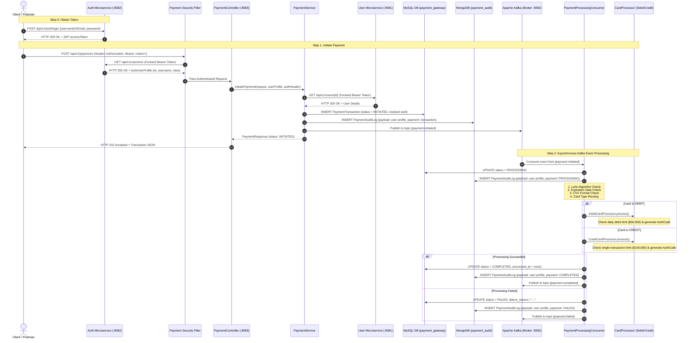

# Payment Microservice Architecture & API Reference Manual

A complete guide covering architecture theory, end-to-end flow diagrams, inter-microservice communication, and detailed Postman execution instructions for the **Payment Service** (`port 8083`), integrating with **Auth** (`port 8082`), **User** (`port 8081`), and **Apache Kafka**.

---

## Table of Contents
1. [System Architecture & Theory](#1-system-architecture--theory)
2. [End-to-End Flow Diagram](#2-end-to-end-flow-diagram)
3. [Component Breakdown](#3-component-breakdown)
4. [Kafka Event Pipeline & Topics](#4-kafka-event-pipeline--topics)
5. [Database Architecture (Dual Persistence)](#5-database-architecture-dual-persistence)
6. [Postman Testing Guide](#6-postman-testing-guide)
   - [Step 0: Login / Obtain JWT Token from Auth Microservice](#step-0-login--obtain-jwt-token-from-auth-microservice)
   - [Step 1: Initiate Debit Card Payment](#step-1-initiate-debit-card-payment-post-apiv1payments)
   - [Step 2: Initiate Credit Card Payment](#step-2-initiate-credit-card-payment-post-apiv1payments)
   - [Step 3: Check Payment Transaction by ID](#step-3-check-payment-transaction-by-id-get-apiv1paymentsid)
   - [Step 4: Get My Payments](#step-4-get-my-payments-get-apiv1payments)
   - [Step 5: View MongoDB Audit Trail](#step-5-view-mongodb-audit-trail-get-apiv1paymentsidaudit-logs)
   - [Step 6: Negative Test Case (Invalid Card / Luhn Failure)](#step-6-negative-test-case-invalid-card--luhn-failure)
7. [Service Ports Summary](#7-service-ports-summary)

---

## 1. System Architecture & Theory

This system is built following modern **Event-Driven Architecture (EDA)** and **Microservice Security Delegation**:

1. **Decoupled Security (No Local JWT Engine)**:
   - The Payment service does **not** contain any JWT creation, parsing, secret keys, or cryptographic verification logic.
   - The **Auth microservice** (`http://localhost:8082`) remains the Single Source of Truth for identity and authentication.
   - Every incoming HTTP request carries an `Authorization: Bearer <token>` header.
   - Spring Security's `TokenAuthenticationFilter` calls the Auth microservice endpoint `GET /api/v1/users/me` by forwarding the header. If valid, the user identity is populated in the security context.

2. **Downstream Inter-Service Communication**:
   - During payment initiation, the Payment service calls the **User microservice** (`http://localhost:8081`) at `GET /api/v1/users/{id}`, passing the caller's JWT token to verify profile status.

3. **Asynchronous Processing via Apache Kafka**:
   - The REST API endpoint does not block waiting for bank/gateway authorization.
   - It records the transaction as `INITIATED` in MySQL, appends an audit event to MongoDB, produces an event to Kafka topic `payment.initiated`, and returns `HTTP 202 Accepted` immediately.
   - A Kafka consumer listener handles validation, card rules, bank authorization, and emits `payment.completed` or `payment.failed`.
   - Kafka event JSON and MongoDB event/audit documents group user details under `payload` and transaction details under `payment`.

---

## 2. End-to-End Flow Diagram



---

## 3. Component Breakdown

| Class | Location | Role |
|---|---|---|
| [`AuthServiceClient`](file:///d:/Antigravity%20IDE/workspaces/test/payment/src/main/java/org/paymentgateway/payment/client/AuthServiceClient.java) | `client/` | Forwards `Authorization: Bearer <token>` to `http://localhost:8082/api/v1/users/me` to authenticate caller. |
| [`UserServiceClient`](file:///d:/Antigravity%20IDE/workspaces/test/payment/src/main/java/org/paymentgateway/payment/client/UserServiceClient.java) | `client/` | Forwards `Authorization: Bearer <token>` to `http://localhost:8081/api/v1/users/{id}` to verify user existence. |
| [`SecurityConfig`](file:///d:/Antigravity%20IDE/workspaces/test/payment/src/main/java/org/paymentgateway/payment/config/SecurityConfig.java) | `config/` | Configures stateless filter chain and `TokenAuthenticationFilter` with zero local JWT parsing. |
| [`PaymentController`](file:///d:/Antigravity%20IDE/workspaces/test/payment/src/main/java/org/paymentgateway/payment/controller/PaymentController.java) | `controller/` | Exposes REST endpoints for payment creation, status querying, user history, and audit trails. |
| [`PaymentService`](file:///d:/Antigravity%20IDE/workspaces/test/payment/src/main/java/org/paymentgateway/payment/service/PaymentService.java) | `service/` | Business orchestrator: masks card number, persists MySQL record, writes MongoDB audit, and produces Kafka event. |
| [`CardValidationService`](file:///d:/Antigravity%20IDE/workspaces/test/payment/src/main/java/org/paymentgateway/payment/service/CardValidationService.java) | `service/` | Implements Mod-10 Luhn algorithm, expiration check, CVV length check, and provider regex detection (VISA, MasterCard, AMEX, Discover). |
| [`DebitCardProcessor`](file:///d:/Antigravity%20IDE/workspaces/test/payment/src/main/java/org/paymentgateway/payment/processor/DebitCardProcessor.java) | `processor/` | Enforces daily debit limits and handles account debit authorizations. |
| [`CreditCardProcessor`](file:///d:/Antigravity%20IDE/workspaces/test/payment/src/main/java/org/paymentgateway/payment/processor/CreditCardProcessor.java) | `processor/` | Enforces credit charge thresholds and issues acquirer credit auth codes. |
| [`PaymentKafkaProducer`](file:///d:/Antigravity%20IDE/workspaces/test/payment/src/main/java/org/paymentgateway/payment/kafka/PaymentKafkaProducer.java) | `kafka/` | Publishes structured JSON payloads to Kafka topics. |
| [`PaymentProcessingConsumer`](file:///d:/Antigravity%20IDE/workspaces/test/payment/src/main/java/org/paymentgateway/payment/service/PaymentProcessingConsumer.java) | `service/` | Consumes `payment.initiated`, coordinates validation + processing, and updates databases. |
| [`NotificationConsumer`](file:///d:/Antigravity%20IDE/workspaces/test/payment/src/main/java/org/paymentgateway/payment/kafka/NotificationConsumer.java) | `kafka/` | Listens to `payment.completed` and `payment.failed` to simulate customer notifications. |

---

## 4. Kafka Event Pipeline & Topics

All Kafka topics are configured in `application.yml` and auto-created by `PaymentAppConfig.java`:

| Topic | Key | Producer | Consumer | Description |
|---|---|---|---|---|
| `payment.initiated` | `transactionId` (from `payment`) | `PaymentService` | `PaymentProcessingConsumer` | JSON has `payload` (user profile), `payment` (transaction details), and `timestamp`. Raw card number, expiry, and CVV are transient processing fields and are not persisted to MongoDB. |
| `payment.completed` | `transactionId` (from `payment`) | `PaymentProcessingConsumer` | `NotificationConsumer` | Same nested shape; raw card data is stripped before publishing. |
| `payment.failed` | `transactionId` (from `payment`) | `PaymentProcessingConsumer` | `NotificationConsumer` | Same nested shape; `payment.failureReason` contains the failure reason. Raw card data is stripped before publishing. |

Kafka event example:
```json
{
  "payload": {
    "userId": 1,
    "username": "alice",
    "email": "alice@example.com",
    "roles": ["ROLE_USER"],
    "enabled": true,
    "createdAt": "2026-09-03T14:00:00Z",
    "updatedAt": "2026-09-03T14:00:00Z"
  },
  "payment": {
    "transactionId": "3fa85f64-5717-4562-b3fc-2c963f66afa6",
    "cardHolderName": "Alice Johnson",
    "cardLastFour": "1111",
    "cardType": "DEBIT",
    "cardProvider": "VISA",
    "amount": 150.75,
    "currency": "USD",
    "status": "INITIATED",
    "description": "Electronics order"
  },
  "timestamp": "2026-09-03T14:15:00Z"
}
```

---

## 5. Database Architecture (Dual Persistence)

### MySQL (`payment_gateway.payment_transactions` Table)
Stores primary transaction records with PCI-DSS safe masked card details:
- `id` (VARCHAR(36), UUID, Primary Key)
- `user_id` (BIGINT)
- `card_holder_name` (VARCHAR(100))
- `card_last_four` (VARCHAR(4)) — *e.g., "1111"*
- `card_type` (ENUM: `DEBIT`, `CREDIT`)
- `card_provider` (ENUM: `VISA`, `MASTERCARD`, `AMEX`, `DISCOVER`, `UNKNOWN`)
- `amount` (DECIMAL(15,2))
- `currency` (VARCHAR(3))
- `status` (`PaymentStatus`: `INITIATED`, `PROCESSING`, `AUTHORIZED`, `COMPLETED`, `FAILED`, `REFUNDED`, `CANCELLED`)
- `description` (VARCHAR(255))
- `failure_reason` (VARCHAR(500))
- `created_at`, `updated_at`, `processed_at` (TIMESTAMP)

### MongoDB (`payment_audit.payment_audit_logs` Collection)
Provides an append-only, immutable historical timeline for every state change:
```json
{
  "_id": "66d74...",
  "payload": {
    "user_id": 1,
    "username": "alice",
    "email": "alice@example.com",
    "roles": ["ROLE_USER"],
    "enabled": true,
    "created_at": "2026-09-03T14:00:00Z",
    "updated_at": "2026-09-03T14:00:00Z"
  },
  "payment": {
    "transaction_id": "9b1deb4d-3b7d-4bad-9bdd-2b0d7b3dcb6d",
    "status": "COMPLETED",
    "amount": 250.00,
    "currency": "USD",
    "card_holder_name": "Alice Johnson",
    "card_last_four": "1111",
    "card_type": "DEBIT",
    "card_provider": "VISA",
    "auth_code": "DEBIT-AUTH-A1B2C3D4",
    "description": "Payment successfully COMPLETED"
  },
  "event_time": "2026-09-03T14:15:30Z",
  "created_at": "2026-09-03T14:15:30Z"
}
```
Documents in `payment_events` use the same `payload` and `payment` nesting, with `eventType`, `eventTime`, and `storedAt` metadata. PAN, CVV, and expiry details are not stored in either MongoDB collection. Existing flat MongoDB records remain readable and searchable through legacy-field fallbacks.

---

## 6. Postman Testing Guide

### Prerequisites
1. **Auth Service** running on port `8082` (`D:\Projects\Payment-Gateway\auth`)
2. **User Service** running on port `8081` (`D:\Projects\Payment-Gateway\user`)
3. **Payment Service** running on port `8083` (`D:\Projects\Payment-Gateway\payment`)
4. **MySQL** (`localhost:3306`), **MongoDB** (`localhost:27017`), and **Kafka** (`localhost:9092`)

Zookeeper and Kafka are already installed on the host. Start them using your installation's startup scripts/configuration before running the Payment Service. The application is configured to connect to the local broker at `localhost:9092`; Docker Kafka is not required.

---

### Step 0: Login / Obtain JWT Token from Auth Microservice

Before calling any Payment API, obtain your Bearer access token:

- **Method**: `POST`
- **URL**: `http://localhost:8082/api/v1/auth/login`
- **Headers**:
  ```http
  Content-Type: application/json
  ```
- **Request Body (raw JSON)**:
  ```json
  {
    "usernameOrEmail": "user",
    "password": "User@123456"
  }
  ```
- **Expected Response (`200 OK`)**:
  ```json
  {
    "success": true,
    "message": "Login successful!",
    "data": {
      "accessToken": "eyJhbGciOiJIUzI1NiIsInR5cCI6IkpXVCJ9...",
      "refreshToken": "7c1b...-...",
      "tokenType": "Bearer",
      "expiresIn": 900,
      "id": 1,
      "username": "user",
      "email": "user@paymentgateway.org",
      "roles": ["ROLE_USER"]
    },
    "timestamp": "2026-09-03T14:10:00Z"
  }
  ```

> 💡 **Copy the `accessToken` value** from the response. You will set this as `Authorization: Bearer <your_accessToken>` in all subsequent requests.

---

### Step 1: Initiate Debit Card Payment (`POST /api/v1/payments`)

- **Method**: `POST`
- **URL**: `http://localhost:8083/api/v1/payments`
- **Headers**:
  ```http
  Content-Type: application/json
  Authorization: Bearer <your_accessToken>
  ```
- **Request Body (raw JSON)**:
  ```json
  {
    "cardType": "DEBIT",
    "cardNumber": "4111111111111111",
    "cardHolderName": "Alice Johnson",
    "expiryMonth": "12",
    "expiryYear": "2028",
    "cvv": "123",
    "amount": 150.75,
    "currency": "USD",
    "description": "Payment for e-commerce electronics order #1042"
  }
  ```
- **Expected Response (`202 Accepted`)**:
  ```json
  {
    "transactionId": "3fa85f64-5717-4562-b3fc-2c963f66afa6",
    "userId": 1,
    "cardHolderName": "Alice Johnson",
    "cardLastFour": "1111",
    "cardType": "DEBIT",
    "cardProvider": "VISA",
    "amount": 150.75,
    "currency": "USD",
    "status": "INITIATED",
    "description": "Payment for e-commerce electronics order #1042",
    "failureReason": null,
    "createdAt": "2026-09-03T14:15:00Z",
    "processedAt": null
  }
  ```

---

### Step 2: Initiate Credit Card Payment (`POST /api/v1/payments`)

- **Method**: `POST`
- **URL**: `http://localhost:8083/api/v1/payments`
- **Headers**:
  ```http
  Content-Type: application/json
  Authorization: Bearer <your_accessToken>
  ```
- **Request Body (raw JSON)** (Mastercard test card):
  ```json
  {
    "cardType": "CREDIT",
    "cardNumber": "5500000000000004",
    "cardHolderName": "Bob Smith",
    "expiryMonth": "08",
    "expiryYear": "2029",
    "cvv": "456",
    "amount": 899.99,
    "currency": "USD",
    "description": "Subscription charge - Annual Enterprise Plan"
  }
  ```
- **Expected Response (`202 Accepted`)**:
  ```json
  {
    "transactionId": "7e2f1a3b-8c4d-4e5f-9a0b-1c2d3e4f5a6b",
    "userId": 1,
    "cardHolderName": "Bob Smith",
    "cardLastFour": "0004",
    "cardType": "CREDIT",
    "cardProvider": "MASTERCARD",
    "amount": 899.99,
    "currency": "USD",
    "status": "INITIATED",
    "description": "Subscription charge - Annual Enterprise Plan",
    "failureReason": null,
    "createdAt": "2026-09-03T14:16:00Z",
    "processedAt": null
  }
  ```

---

### Step 3: Check Payment Transaction by ID (`GET /api/v1/payments/{id}`)

After Kafka consumes and processes the event (usually under 1 second), query the transaction:

- **Method**: `GET`
- **URL**: `http://localhost:8083/api/v1/payments/3fa85f64-5717-4562-b3fc-2c963f66afa6`
- **Headers**:
  ```http
  Authorization: Bearer <your_accessToken>
  ```
- **Expected Response (`200 OK`)**:
  ```json
  {
    "transactionId": "3fa85f64-5717-4562-b3fc-2c963f66afa6",
    "userId": 1,
    "cardHolderName": "Alice Johnson",
    "cardLastFour": "1111",
    "cardType": "DEBIT",
    "cardProvider": "VISA",
    "amount": 150.75,
    "currency": "USD",
    "status": "COMPLETED",
    "description": "Payment for e-commerce electronics order #1042 | AuthCode: DEBIT-AUTH-4F8A9B1C",
    "failureReason": null,
    "createdAt": "2026-09-03T14:15:00Z",
    "processedAt": "2026-09-03T14:15:01Z"
  }
  ```

---

### Step 4: Get My Payments (`GET /api/v1/payments`)

Retrieves the authenticated caller's transactions, newest first. Add the optional `status` query parameter to filter results. For example, request `http://localhost:8083/api/v1/payments?status=COMPLETED`. Valid values are `INITIATED`, `PROCESSING`, `AUTHORIZED`, `COMPLETED`, `FAILED`, `REFUNDED`, and `CANCELLED`; values are case-sensitive, and an invalid value returns `400 Bad Request`.

- **Method**: `GET`
- **URL**: `http://localhost:8083/api/v1/payments`
- **Headers**:
  ```http
  Authorization: Bearer <your_accessToken>
  ```
- **Expected Response (`200 OK`)**:
  ```json
  [
    {
      "transactionId": "3fa85f64-5717-4562-b3fc-2c963f66afa6",
      "userId": 1,
      "cardHolderName": "Alice Johnson",
      "cardLastFour": "1111",
      "cardType": "DEBIT",
      "cardProvider": "VISA",
      "amount": 150.75,
      "currency": "USD",
      "status": "COMPLETED",
      "description": "Payment for e-commerce electronics order #1042 | AuthCode: DEBIT-AUTH-4F8A9B1C",
      "failureReason": null,
      "createdAt": "2026-09-03T14:15:00Z",
      "processedAt": "2026-09-03T14:15:01Z"
    },
    {
      "transactionId": "7e2f1a3b-8c4d-4e5f-9a0b-1c2d3e4f5a6b",
      "userId": 1,
      "cardHolderName": "Bob Smith",
      "cardLastFour": "0004",
      "cardType": "CREDIT",
      "cardProvider": "MASTERCARD",
      "amount": 899.99,
      "currency": "USD",
      "status": "COMPLETED",
      "description": "Subscription charge - Annual Enterprise Plan | AuthCode: CREDIT-AUTH-1B2C3D4E",
      "failureReason": null,
      "createdAt": "2026-09-03T14:16:00Z",
      "processedAt": "2026-09-03T14:16:01Z"
    }
  ]
  ```

---

### Step 5: View MongoDB Audit Trail (`GET /api/v1/payments/{id}/audit-logs`)

Fetches chronological MongoDB audit documents showing each step of the lifecycle:

- **Method**: `GET`
- **URL**: `http://localhost:8083/api/v1/payments/3fa85f64-5717-4562-b3fc-2c963f66afa6/audit-logs`
- **Headers**:
  ```http
  Authorization: Bearer <your_accessToken>
  ```
- **Expected Response (`200 OK`)**:
  ```json
  [
    {
      "id": "66d74001a1b2c3d4e5f60003",
      "payload": {
        "userId": 1,
        "username": "alice",
        "email": "alice@example.com",
        "roles": ["ROLE_USER"],
        "enabled": true,
        "createdAt": "2026-09-03T14:00:00Z",
        "updatedAt": "2026-09-03T14:00:00Z"
      },
      "payment": {
        "transactionId": "3fa85f64-5717-4562-b3fc-2c963f66afa6",
        "status": "COMPLETED",
        "amount": 150.75,
        "currency": "USD",
        "cardHolderName": "Alice Johnson",
        "cardLastFour": "1111",
        "cardType": "DEBIT",
        "cardProvider": "VISA",
        "authCode": "DEBIT-AUTH-4F8A9B1C",
        "description": "Payment successfully COMPLETED. AuthCode: DEBIT-AUTH-4F8A9B1C"
      },
      "eventTime": "2026-09-03T14:15:01Z",
      "createdAt": "2026-09-03T14:15:01Z"
    },
    {
      "id": "66d74001a1b2c3d4e5f60002",
      "payload": {
        "userId": 1,
        "username": "alice",
        "email": "alice@example.com",
        "roles": ["ROLE_USER"],
        "enabled": true
      },
      "payment": {
        "transactionId": "3fa85f64-5717-4562-b3fc-2c963f66afa6",
        "status": "PROCESSING",
        "amount": 150.75,
        "currency": "USD",
        "cardLastFour": "1111",
        "cardType": "DEBIT",
        "cardProvider": "VISA",
        "description": "Payment marked as PROCESSING in consumer"
      },
      "eventTime": "2026-09-03T14:15:00.500Z",
      "createdAt": "2026-09-03T14:15:00.500Z"
    },
    {
      "id": "66d74001a1b2c3d4e5f60001",
      "payload": {
        "userId": 1,
        "username": "alice",
        "email": "alice@example.com",
        "roles": ["ROLE_USER"],
        "enabled": true
      },
      "payment": {
        "transactionId": "3fa85f64-5717-4562-b3fc-2c963f66afa6",
        "status": "INITIATED",
        "amount": 150.75,
        "currency": "USD",
        "cardLastFour": "1111",
        "cardType": "DEBIT",
        "cardProvider": "VISA",
        "description": "Payment INITIATED by user alice (Token: tok_example)"
      },
      "eventTime": "2026-09-03T14:15:00Z",
      "createdAt": "2026-09-03T14:15:00Z"
    }
  ]
  ```

Each audit response groups the user profile under `payload` and transaction fields under `payment`.

Payment errors use a consistent response with `timestamp`, `status`, `error`, `message`, and `path`. Validation failures also include `validationErrors`; null fields are omitted. A capture/refund attempt against a failed payment returns `422 Unprocessable Entity` with `"error": "Payment Failed"` and the recorded failure reason in `message`.

Example payment failure response:
```json
{
  "timestamp": "2026-09-03T14:17:02Z",
  "status": 422,
  "error": "Payment Failed",
  "message": "Payment failed: Insufficient funds",
  "path": "/api/v1/payments/3fa85f64-5717-4562-b3fc-2c963f66afa6/capture"
}
```

---

### Step 6: Negative Test Case (Invalid Card / Luhn Failure)

Testing Luhn failure handling:

- **Method**: `POST`
- **URL**: `http://localhost:8083/api/v1/payments`
- **Headers**:
  ```http
  Content-Type: application/json
  Authorization: Bearer <your_accessToken>
  ```
- **Request Body (raw JSON)** (invalid Luhn checksum):
  ```json
  {
    "cardType": "DEBIT",
    "cardNumber": "4111111111111112",
    "cardHolderName": "Charlie Brown",
    "expiryMonth": "11",
    "expiryYear": "2027",
    "cvv": "123",
    "amount": 50.00,
    "currency": "USD",
    "description": "Invalid card test"
  }
  ```
- The API initially accepts the request (`202 Accepted` with `status: INITIATED`).
- Kafka consumer validates the card, fails the Luhn check, and publishes to `payment.failed`.
- Querying `GET /api/v1/payments/{id}` shows:
  ```json
  {
    "transactionId": "...",
    "userId": 1,
    "cardLastFour": "1112",
    "cardType": "DEBIT",
    "status": "FAILED",
    "failureReason": "Invalid card number (Luhn check failed)",
    "processedAt": "2026-09-03T14:17:01Z"
  }
  ```

---

## 7. Service Ports Summary

| Service | Port | Base Path | Swagger URL |
|---|---|---|---|
| **User Service** | `8081` | `/api/v1/users` | `http://localhost:8081/swagger-ui.html` |
| **Auth Service** | `8082` | `/api/v1/auth` | `http://localhost:8082/swagger-ui.html` |
| **Payment Service** | `8083` | `/api/v1/payments` | `http://localhost:8083/swagger-ui.html` |
| **MySQL** | `3306` | — | `payment_gateway` |
| **MongoDB** | `27017` | — | `payment_audit.payment_audit_logs` |
| **Apache Kafka** | `9092` | — | Bootstrap broker |
