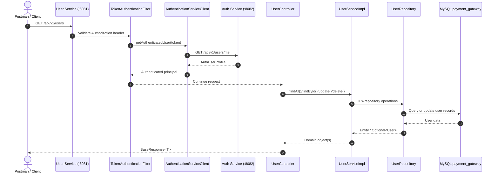

# User Service Architecture & Postman API Guide

This guide documents the User Management microservice architecture, request/response contracts, error handling, and the exact Postman steps to validate the service in a Payment Gateway setup.

---

## 1. System architecture

The User service owns the user profile domain and delegates identity validation to the Auth service. It exposes CRUD endpoints under `/api/v1/users` and returns a standardized JSON envelope.



### Core components

| Component | Responsibility |
|---|---|
| `UserController` | Exposes REST endpoints and handles validation and authorization flow. |
| `UserServiceImpl` | Carries out create/read/update/delete logic and partial-update logic. |
| `UserRepository` | Persists and queries `User` entities from MySQL. |
| `AuthenticationServiceClient` | Calls Auth service to validate the current bearer token. |
| `TokenAuthenticationFilter` | Reads the incoming JWT and populates the security context. |
| `GlobalExceptionHandler` | Converts exceptions into consistent `BaseResponse` payloads. |
| `ResourceNotFoundException` | Signals a missing user or related resource. |
| MySQL | Stores user, role, and relational data. |

---

## 2. Base response contract

All endpoints return a common wrapper:

```json
{
  "status": "SUCCESS",
  "message": "Record found",
  "data": {}
}
```

### Response fields

| Field | Type | Meaning |
|---|---|---|
| `status` | `String` | `SUCCESS` or `ERROR` |
| `message` | `String` | Human-readable summary |
| `data` | `Object` / `null` | Actual payload or error details |

### Success examples

```json
{
  "status": "SUCCESS",
  "message": "Record found",
  "data": {
    "id": 1,
    "username": "alice",
    "email": "alice@example.com",
    "enabled": true,
    "accountNonLocked": true
  }
}
```

```json
{
  "status": "SUCCESS",
  "message": "Record updated successfully",
  "data": {
    "id": 42,
    "email": "new-address@example.com"
  }
}
```

### Error examples

```json
{
  "status": "ERROR",
  "message": "User not found",
  "data": null
}
```

```json
{
  "status": "ERROR",
  "message": "Validation failed",
  "data": {
    "email": "must be a well-formed email address"
  }
}
```

---

## 3. Endpoint reference

Base path: `/api/v1/users`

| Method | Endpoint | Purpose |
|---|---|---|
| `GET` | `/api/v1/users` | Fetch all users |
| `GET` | `/api/v1/users/{id}` | Fetch one user by ID |
| `PUT` | `/api/v1/users/{id}` | Partial update user record |
| `DELETE` | `/api/v1/users/{id}` | Delete a user |

### Authentication requirement

Every request must include:

```http
Authorization: Bearer <jwt-token>
```

The token is validated by the Auth microservice via `GET /api/v1/users/me`.

---

## 4. Request payloads

### 4.1 Get all users

```http
GET http://localhost:8081/api/v1/users
Authorization: Bearer <jwt-token>
```

Expected HTTP status: `200 OK`

### 4.2 Get user by ID

```http
GET http://localhost:8081/api/v1/users/1
Authorization: Bearer <jwt-token>
```

Expected HTTP status: `200 OK` or `404 Not Found`

### 4.3 Partial update user

```http
PUT http://localhost:8081/api/v1/users/42
Authorization: Bearer <jwt-token>
Content-Type: application/json
```

```json
{
  "email": "new-address@example.com",
  "enabled": false
}
```

Notes:
- Only non-null values are applied.
- Omitted fields remain unchanged.
- `username`, `email`, and boolean fields can be updated depending on `UserUpdateRequest` validation rules.

### 4.4 Delete user

```http
DELETE http://localhost:8081/api/v1/users/42
Authorization: Bearer <jwt-token>
```

Expected HTTP status: `200 OK`

---

## 5. Postman testing flow

### Step 1: Obtain a JWT from the Auth service

- Method: `POST`
- URL: `http://localhost:8082/api/v1/auth/login`
- Headers:

```http
Content-Type: application/json
```

- Body:

```json
{
  "usernameOrEmail": "admin",
  "password": "Admin@123456"
}
```

Successful response example:

```json
{
  "success": true,
  "message": "Login successful!",
  "data": {
    "accessToken": "eyJhbGciOiJIUzI1NiJ9...",
    "refreshToken": "...",
    "tokenType": "Bearer"
  }
}
```

Copy the `accessToken` value into the Postman Authorization header for the User service calls.

### Step 2: Get all users

- Method: `GET`
- URL: `http://localhost:8081/api/v1/users`
- Headers:

```http
Authorization: Bearer <jwt-token>
```

Expected result:
- `200 OK`
- A `BaseResponse` payload with `status = SUCCESS`

### Step 3: Get user by ID

- Method: `GET`
- URL: `http://localhost:8081/api/v1/users/1`
- Headers:

```http
Authorization: Bearer <jwt-token>
```

Expected result:
- `200 OK` if user exists
- `404 Not Found` if user does not exist

### Step 4: Update a user partially

- Method: `PUT`
- URL: `http://localhost:8081/api/v1/users/1`
- Headers:

```http
Authorization: Bearer <jwt-token>
Content-Type: application/json
```

- Body:

```json
{
  "email": "updated@example.com",
  "enabled": true
}
```

Expected result:
- `200 OK`
- Response message: `Record updated successfully`

### Step 5: Delete a user

- Method: `DELETE`
- URL: `http://localhost:8081/api/v1/users/1`
- Headers:

```http
Authorization: Bearer <jwt-token>
```

Expected result:
- `200 OK`
- Response message: `Record deleted successfully`

---

## 6. Error handling and HTTP status codes

The User service uses a centralized exception strategy. `GlobalExceptionHandler` maps domain and validation errors into the standard response envelope.

| HTTP status | Scenario | Example message |
|---|---|---|
| `200 OK` | Successful GET / PUT / DELETE | `Record found`, `Record updated successfully` |
| `400 Bad Request` | Validation failure in `UserUpdateRequest` | `Validation failed` |
| `404 Not Found` | Missing user or resources | `User not found` |
| `500 Internal Server Error` | Unexpected server-side issue | `Internal Server Error: ...` |
| `503 Service Unavailable` | Circuit breaker fallback triggered | `Service temporarily unavailable, please try again later` |

### Validation example

Request body:

```json
{
  "email": "not-an-email"
}
```

Response:

```json
{
  "status": "ERROR",
  "message": "Validation failed",
  "data": {
    "email": "must be a well-formed email address"
  }
}
```

### Not found example

Request:

```http
GET http://localhost:8081/api/v1/users/99999
Authorization: Bearer <jwt-token>
```

Response:

```json
{
  "status": "ERROR",
  "message": "User not found",
  "data": null
}
```

---

## 7. Implementation notes

- The current design validates the incoming bearer token against Auth before processing the request.
- The update endpoint supports partial update semantics: null values are ignored and existing fields are retained.
- `ResourceNotFoundException` and `GlobalExceptionHandler` are used to produce clean 404 responses.
- The application is configured for a MySQL-backed `payment_gateway` database and a Docker/service-oriented microservice deployment.

---

## 8. Minimal Postman collection recipe

### Authorization header

```http
Authorization: Bearer <jwt-token>
```

### Example environment variables

| Variable | Example |
|---|---|
| `baseUrl` | `http://localhost:8081` |
| `authBaseUrl` | `http://localhost:8082` |
| `jwtToken` | `{{accessToken}}` |

### Typical request set

1. `POST {{authBaseUrl}}/api/v1/auth/login`
2. `GET {{baseUrl}}/api/v1/users`
3. `GET {{baseUrl}}/api/v1/users/1`
4. `PUT {{baseUrl}}/api/v1/users/1`
5. `DELETE {{baseUrl}}/api/v1/users/1`

This collection provides the standard flow for validating user identity, reading user profiles, updating selected fields, and handling not-found and validation failures.
