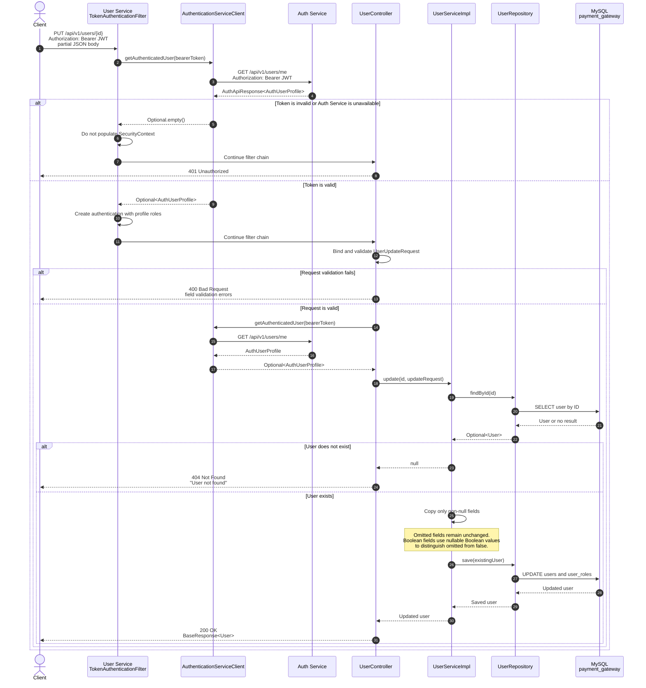

# User Update Sequence Diagram

The update endpoint supports partial updates. Only non-null fields supplied in `UserUpdateRequest` are copied to the existing user entity.



## Request example

```http
PUT /api/v1/users/42
Authorization: Bearer <JWT>
Content-Type: application/json
```

```json
{
  "email": "new-address@example.com",
  "enabled": false
}
```

The service changes only `email` and `enabled`. Existing username, password, roles, and other account-status fields are preserved.

## Main implementation responsibilities

| Component | Responsibility |
|---|---|
| `TokenAuthenticationFilter` | Validates the bearer token and establishes the security context. |
| `AuthenticationServiceClient` | Calls the Auth Service and returns the authenticated profile. |
| `UserController` | Binds the request, validates the DTO, and maps the result to HTTP status and response body. |
| `UserServiceImpl` | Loads the existing entity, applies only supplied fields, and saves it. |
| `UserRepository` | Reads and persists the user entity. |
| MySQL | Stores the updated user and role association data. |

## Current implementation note

The current request path validates the token in the security filter and performs another profile lookup inside `UserController.update`. This is represented in the diagram because it is the current behavior; the controller-level lookup can later be removed if the authenticated principal from the security context is used directly.
